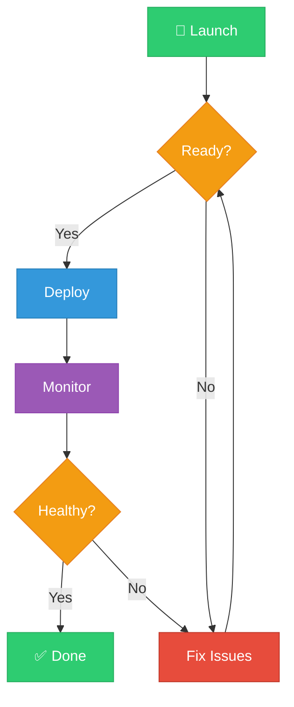
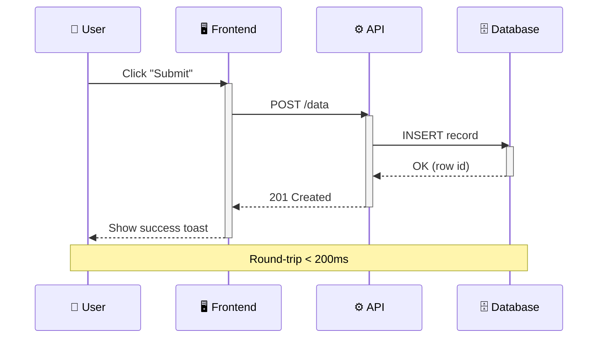
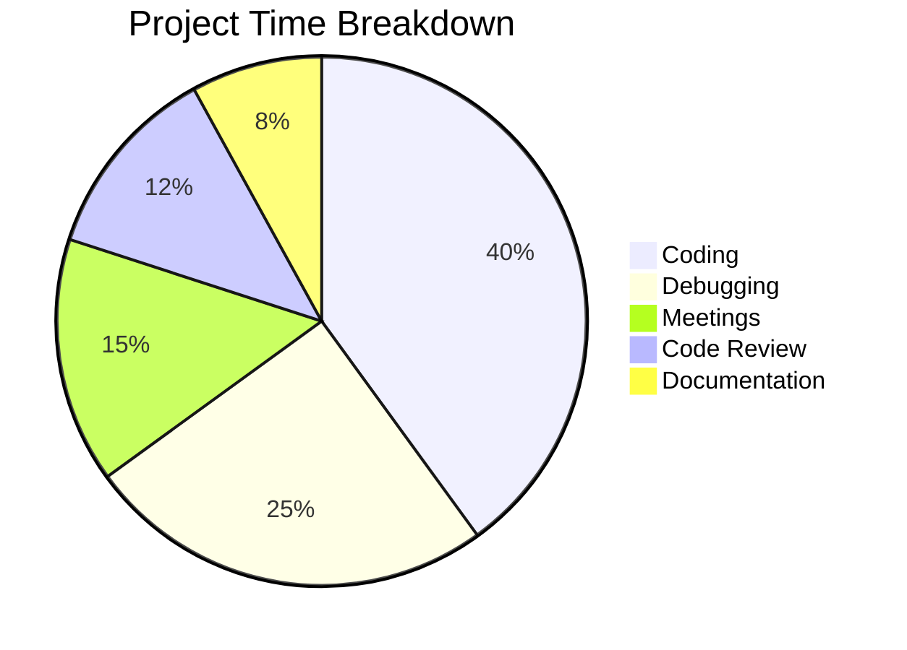
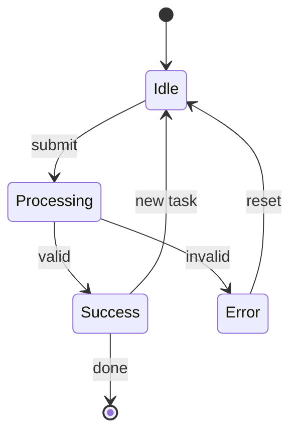

# Mermaid Viewer — Sample Diagrams

## Flowchart with Styled Nodes

```mermaid
graph TD
    A[🚀 Launch]:::green --> B{Ready?}:::orange
    B -->|Yes| C[Deploy]:::blue
    B -->|No| D[Fix Issues]:::red
    D --> B
    C --> E[Monitor]:::purple
    E --> F{Healthy?}:::orange
    F -->|Yes| G[✅ Done]:::green
    F -->|No| D

    classDef green fill:#2ecc71,stroke:#27ae60,color:#fff
    classDef red fill:#e74c3c,stroke:#c0392b,color:#fff
    classDef blue fill:#3498db,stroke:#2980b9,color:#fff
    classDef orange fill:#f39c12,stroke:#e67e22,color:#fff
    classDef purple fill:#9b59b6,stroke:#8e44ad,color:#fff
```

## Sequence Diagram

```mermaid
sequenceDiagram
    participant U as 👤 User
    participant F as 🖥️ Frontend
    participant A as ⚙️ API
    participant D as 🗄️ Database

    U->>F: Click "Submit"
    activate F
    F->>A: POST /data
    activate A
    A->>D: INSERT record
    activate D
    D-->>A: OK (row id)
    deactivate D
    A-->>F: 201 Created
    deactivate A
    F-->>U: Show success toast
    deactivate F

    Note over U,D: Round-trip < 200ms
```

## Pie Chart

```mermaid
pie title Project Time Breakdown
    "Coding" : 40
    "Debugging" : 25
    "Meetings" : 15
    "Code Review" : 12
    "Documentation" : 8
```

## State Diagram

```mermaid
stateDiagram-v2
    [*] --> Idle
    Idle --> Processing : submit
    Processing --> Success : valid
    Processing --> Error : invalid
    Error --> Idle : reset
    Success --> Idle : new task
    Success --> [*] : done
```
